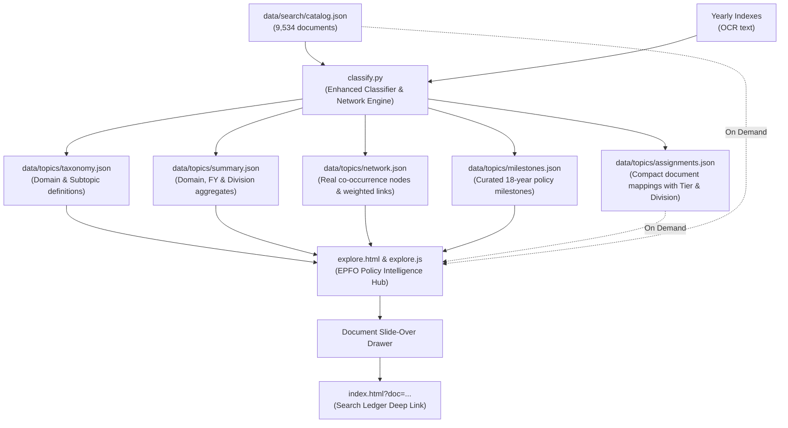

# Architecture & Design Specification: EPFO Policy Intelligence Hub

**Date:** 2026-09-04  
**Status:** Approved  
**Target Application:** `explore.html`, `classify.py`, `data/topics/`  
**Related Documents:** `plan.md`, `graph-demo.html`, `index.html`

---

## 1. Executive Overview

This specification establishes the architectural and analytical design for the **EPFO Policy Intelligence Hub**. It transforms the circular archive from a static collection of 9,534 circulars (spanning 2009–2027) into an interactive policy intelligence application.

It resolves four core deficiencies identified in the previous implementations of `explore.html` and `graph-demo.html`:
1. **Administrative Noise**: Routine personnel transfers, APAR schedules, and DPC promotion lists account for ~38% of all circulars, submerging crucial public policy circulars. The Hub introduces a top-level **Signal vs. Noise** filter (`Public Policy & Schemes` vs. `Internal Administration`).
2. **Unclassified Data Gaps**: 1,894 circulars (~19.9% of the corpus) were categorized as `unclassified` due to narrow keyword matching. Enhanced classification rules recover these into their true domains (Finance, Compliance, Pension, IT, Exemption).
3. **Mock Data in the Relationship Graph**: `graph-demo.html` relied on synthetic links and sample documents. The Hub replaces this with a live D3 force-directed network calculated from real secondary-topic co-occurrences across all 9,534 circulars.
4. **Lack of Policy Narrative**: The Hub introduces an interactive **Milestone Chronicle** organizing 18 years of EPFO reform into six distinct regulatory eras with direct links to founding circulars.

---

## 2. System Architecture & Data Pipeline



### 2.1 Classifier Enhancements (`classify.py`)

The offline classifier is upgraded with the following capabilities:

1. **Recovery of Unclassified Circulars**:
   - **Finance & Interest**: Matches "prompt interest credit", "annual accounts", "reconciliation of remittances", "audit manual", "depreciation of fixed assets".
   - **Compliance & Recovery**: Matches "IBC", "insolvency", "resolution plan", "damages under section 14B / 7Q", "Code on Social Security (CoSS)", "Amnesty 2026", "Vishwas 2026".
   - **IT & Digital Systems**: Matches "Samadhan Setu", "e-Office scheduled downtime", "member portal updates", "issue tracker".
   - **Pension & EPS-95**: Matches "Dearness Relief to pensioners", "higher pension options", "pension fund valuation".
   - **Exempted Establishments**: Matches "private trust surrender", "compliance audit of private trusts".
   - **Governance & CBT**: Matches "Central Board meeting", "advisory committee", "gazette notification".

2. **Dual-Tier Metadata Tagging**:
   - Every document is tagged with `tier`:
     - `policy`: Public policy and member welfare (Pension, Compliance, Claims, Exemptions, Investments, Digital Portals, Social Security).
     - `admin`: Internal administration (Staff transfers, APAR schedules, DPC promotions, internal exams, sports, holiday notices, Rajbhasha inspections).

3. **Originating Division Extraction**:
   - Analyzes circular numbers and title prefixes to assign `division`:
     - `WSU` (Web Services / Member Portals)
     - `Pension` (EPS-95 / PPO)
     - `Compliance` (CAIU / 7A / 14B / Recovery)
     - `Finance` (Investment / BSC / Budget / Audit)
     - `Exemption` (Private PF Trusts)
     - `Legal` (Court cases, CAT, Supreme Court)
     - `IS` (Information Systems / NDC)
     - `HRM` (HRD / Cadre / Personnel)
     - `PDUNASS` (Training / NATRSS)
     - `CSD` (Customer Service / Grievances / RTI)
     - `Coordination` (CBT / Board)

4. **Network Co-occurrence Generation (`data/topics/network.json`)**:
   - Calculates weighted co-occurrences between primary domains, secondary topics, and major statutory hubs (`Section 7A/14B`, `Higher Pension SC Ruling`, `Exempted Trusts`, `Code on Social Security`).
   - Output format:
     ```json
     {
       "nodes": [
         { "id": "pension_eps", "name": "Pension & EPS-95", "count": 295, "color": "#059669", "tier": "policy" }
       ],
       "links": [
         { "source": "pension_eps", "target": "legal_litigation", "value": 45, "example_ids": [102, 345, 891] }
       ]
     }
     ```

5. **Milestones Generation (`data/topics/milestones.json`)**:
   - Curates 15 major historical turning points with dates, titles, summaries, affected audiences, and founding circular IDs.

---

## 3. Frontend Architecture (`explore.html`)

### 3.1 Global Controls Bar

The top navigation and controls bar contains:
- **Signal-vs-Noise Segmented Control**:
  - `All Circulars (9,534)`: Complete archive.
  - `Public Policy & Schemes (~3,800)`: **Default view**. Focuses solely on citizen, member, and employer policies.
  - `Internal Administration (~5,700)`: Dedicated view for internal personnel and cadre circulars.
- **Financial Year Selector**: Dropdown from `2009–2010` to `2026–2027` + `All Years`.
- **Division Selector**: Filter by issuing wing (`All Wings`, `WSU`, `Pension`, `Compliance`, `Finance`, `Legal`, `Exemption`, etc.).
- **Live Counter Pills**: Dynamic counters displaying visible circulars, domains, divisions, and bilingual ratio.

### 3.2 The Four Core Views

```text
[ View Switcher: Policy Atlas | Policy Network | Milestone Chronicle | Division Matrix ]
```

#### View 1: Policy Atlas (Hierarchical Treemap)
- Sized proportionally by circular count within the active tier and year filters.
- Clicking a domain zooms into subtopics with interactive breadcrumb trails.
- Selecting any subtopic triggers the slide-over document drawer pre-filtered for that subtopic.

#### View 2: Policy Network (Real-Data Co-occurrence Graph)
- Built with D3.js force-directed simulation (`d3.forceSimulation`).
- **Nodes**: Sized by volume, colored by domain palette.
- **Edges**: Thickness represents the true number of bridging circulars.
- **Interactive Controls**:
  - Minimum connection strength slider (filters out weak links).
  - Search / focus topic dropdown.
  - Zoom and pan with double-click reset.
- **Selection Detail Panel**:
  - Clicking a node highlights its direct neighbors and lists its strongest relationships.
  - Clicking an edge reveals the relationship rationale and previews the exact circulars bridging both topics, with a button to open them in the drawer.

#### View 3: Milestone Chronicle (Policy Evolution Timeline)
- Chronological timeline structured into six policy eras:
  1. **2009–2013**: Computerization & Centralization
  2. **2014–2017**: Universal Account Number (UAN) & Digital Leap
  3. **2018–2020**: Mobile Services (UMANG) & Ease of Business
  4. **2020–2022**: COVID-19 Emergency Relief (Non-refundable advances & PMGKY)
  5. **2022–2024**: Higher Pension Watershed (Supreme Court judgment & joint options)
  6. **2024–2027**: Next-Gen CITES 2.0, Code on Social Security & Amnesty 2026
- Each milestone card highlights:
  - Event date and official title.
  - Regulatory background and practical member/employer impact.
  - Interactive pill linking to founding circulars.

#### View 4: Division & Regulatory Matrix (Operational Heatmap)
- 2D cross-tabulation heatmap:
  - **Y-Axis**: Issuing divisions (`WSU`, `Pension`, `Compliance`, `Finance`, `Legal`, `Exemption`, `HRM`, `PDUNASS`, `CSD`).
  - **X-Axis**: 18 Financial Years (`2009–10` through `2026–27`).
  - **Cell Intensity**: Color saturation reflects circular publication volume.
- Interactive tooltip with exact counts.
- Clicking any cell loads the matching circulars directly into the document drawer.

---

## 4. Document Drawer & Primary Source Inspection

The slide-over document drawer provides immediate access to primary documents:
- **Instant Search**: Real-time filtering within the active list by title, circular number, or date.
- **Document Card Attributes**:
  - Circular number in monospace format.
  - Issuance date and financial year badge.
  - Primary topic badge and secondary domain tags.
  - Issuing division pill (e.g. `WSU`, `Pension`, `CAIU`).
  - Bilingual tag (`English + Hindi`, `English only`, `Hindi only`).
  - Direct PDF open/download link.
  - Deep link into the Search Ledger (`index.html?doc=...`).

---

## 5. Performance, Accessibility & Integration

### 5.1 Performance Targets
- **Initial Network Payload**: < 100 KB gzipped (HTML + D3 CDN + `taxonomy.json` + `summary.json` + `network.json` + `milestones.json`).
- **Initial Render Time**: < 200 ms on static GitHub Pages hosting.
- **Progressive Loading**: Full `assignments.json` (~600 KB) and `catalog.json` (~3.2 MB) load asynchronously only when the user opens the drawer or searches.

### 5.2 Accessibility
- Semantic ARIA attributes across all tabs (`role="tablist"`, `role="tab"`, `role="tabpanel"`).
- Keyboard-navigable tree, graph nodes, and timeline cards (Enter/Space to select).
- Accessible color contrast ratios (> 4.5:1) for all labels and chart elements.
- Drawer traps focus with Escape key support to close.

### 5.3 Deprecation / Transition for `graph-demo.html`
- `graph-demo.html` is updated to include a prominent banner linking to the live Unified Hub at `explore.html#network`. It can also be wired to the new `data/topics/network.json` so existing bookmarks display real data.

---

## 6. Implementation Plan Sequence

1. **Data Pipeline Update (`classify.py`)**:
   - Enhance keyword definitions to resolve unclassified circulars.
   - Implement tier tagging (`policy` vs `admin`) and division extraction.
   - Compute real co-occurrences and write `data/topics/network.json`.
   - Curate and export `data/topics/milestones.json`.
   - Re-generate `taxonomy.json`, `assignments.json`, and `summary.json`.
2. **Frontend UI Overhaul (`explore.html` & `explore.js`)**:
   - Rebuild layout with global controls (Signal switch, Year, Division).
   - Implement Policy Atlas (Treemap).
   - Implement real-data Policy Network (D3 force graph).
   - Implement Milestone Chronicle timeline.
   - Implement Division & Regulatory Matrix heatmap.
   - Update Document Drawer with rich metadata pills and deep links.
3. **Verification & Quality Audit**:
   - Verify unclassified drop (< 5% of total corpus).
   - Verify all milestone deep links resolve to existing circulars.
   - Verify graph edge clicks display accurate bridging documents.
   - Test responsive behavior across mobile (360px) and desktop (1600px).
