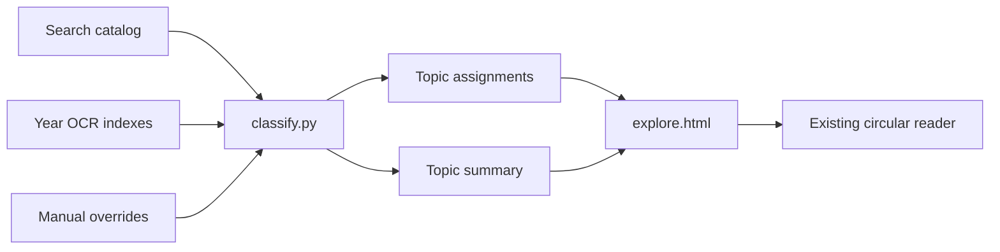

# EPFO Circular Topic Explorer Plan

The first release will use one lightweight `explore.html` page containing a Topic Atlas and a Topic Evolution view. An experimental network visualization can be added later after secondary-topic classifications are reliable.

## 1. Establish the topic taxonomy

Start with a provisional taxonomy rather than accepting estimated category counts in advance.

Suggested primary domains:

1. EPF membership, contributions and benefits
2. Pension and EPS-95
3. EDLI and insurance
4. Claims, withdrawals, transfers and member records
5. Compliance, coverage, recovery and inspections
6. Exempted establishments
7. Finance, accounts, banking, investments and budget
8. IT, UAN, KYC, digital services and cybersecurity
9. HR, personnel, cadre, recruitment and vigilance
10. Legal, litigation and quasi-judicial matters
11. Citizen services, grievances and RTI
12. Training, research and departmental examinations
13. Official language, communications and events
14. Administration, procurement, buildings and vehicles
15. Social-security campaigns and international workers
16. Other / Unclassified

Each domain can contain specific subtopics. The final taxonomy will be adjusted after examining the actual distribution and ambiguous documents.

## 2. Build an explainable offline classifier

Create:

```text
classify.py
data/topic-taxonomy.json
data/topic-overrides.json
```

The classifier will read:

```text
data/search/catalog.json
data/index-YYYY-YYYY.json
```

Classification evidence will be weighted:

```text
Title                 x5
Circular number       x3
PDF filename          x3
Extracted PDF text    x1
```

Processing order:

1. Normalize HTML entities, punctuation and Unicode.
2. Match English and Hindi keywords.
3. Score domains and subtopics.
4. Select one primary domain.
5. Add secondary tags only when strongly supported.
6. Calculate confidence from evidence strength and separation from the second-best category.
7. Send ambiguous documents to `Other / Unclassified`.
8. Apply manual overrides last.

A document should never be assigned to a category solely because of a weak incidental OCR reference when its title indicates something else.

Example classification:

```json
{
  "document_key": "stable-pdf-url-or-hash",
  "domain": "administration",
  "subtopic": "vehicles",
  "secondary_topics": ["procurement"],
  "basis": ["title", "circular_number"],
  "confidence": "high",
  "rule": "administration.vehicles"
}
```

## 3. Review classification quality

Before building charts:

- Confirm that all 9,534 documents are assigned or explicitly unclassified.
- Review every low-confidence classification.
- Review a representative sample from each major domain.
- Inspect unusually large categories for overly broad rules.
- Inspect very small categories for missing keywords.
- Check common cross-domain cases manually.

Initial known checks should include:

```text
Hiring of Vehicles
-> Administration -> Procurement & Facilities -> Vehicles

Higher Pension / Supreme Court judgment
-> Pension & EPS-95 -> Higher Pension

UAN activation
-> IT & Digital Systems -> UAN

CPIO appointment
-> Citizen Services -> RTI

Section 7A inquiry
-> Compliance -> 7A Proceedings
```

No historical surge claims should be added until the resulting counts demonstrate them.

## 4. Generate compact visualization data

Create:

```text
data/topics/taxonomy.json
data/topics/assignments.json
data/topics/summary.json
data/topics/review.json
```

Responsibilities:

- `taxonomy.json`: domain and subtopic definitions.
- `assignments.json`: compact document-to-topic mappings.
- `summary.json`: pre-aggregated domain, subtopic and financial-year counts.
- `review.json`: ambiguous and unclassified documents.

The visualization must not duplicate OCR text.



## 5. Build `explore.html`

The page will contain two views.

### View 1: Topic Atlas

Use a zoomable treemap.

- Rectangle size represents circular count.
- Major domains have consistent colors.
- Nested rectangles represent subtopics.
- Labels show topic and count.
- Clicking a domain zooms into its subtopics.
- Breadcrumbs return to higher levels.
- Selecting a subtopic opens a document drawer.
- The drawer shows the title, circular number, date and financial year.
- Document actions link to the existing archive reader.

Example deep link:

```text
index.html?fy=2024-2025&doc=document-name.pdf
```

Useful filters:

- Financial year
- Language availability
- Primary domain

The first render should show the complete archive without requiring input.

### View 2: Topic Evolution

Use a topic-by-financial-year heatmap.

```text
Rows    -> domains or subtopics
Columns -> financial years
Color   -> circular volume
```

Interactions:

- Toggle between absolute count and percentage of yearly circulars.
- Hover or focus a cell to see the exact count.
- Click a cell to open its document list.
- Select a major domain to expand its subtopics.
- Use the same colors as the treemap.

The heatmap should reveal historical changes without pre-written assumptions about which years contain surges.

## 6. GitHub Pages optimization

Initial page load should require only:

```text
explore.html
taxonomy.json
summary.json
```

Load additional data progressively:

- Load `assignments.json` when a topic is selected.
- Load the existing catalog when the document drawer is first opened.
- Never load OCR indexes from the visualization.
- Open reproductions through the existing `index.html` deep link.
- Cache fetched JSON naturally through the browser and GitHub Pages CDN.

This keeps the visualization much lighter than the search page.

## 7. Accessibility and responsive behavior

- Treemap cells must support keyboard selection.
- Color must always be paired with a visible label.
- Heatmap cells need accessible topic, year and count labels.
- Tooltips cannot contain essential information exclusively.
- On mobile, replace the dense treemap with a drill-down topic list if labels no longer fit.
- The document drawer should become a full-width panel on small screens.
- Respect reduced-motion preferences.

## 8. Automation

After classification is stable, extend the data workflow with:

```bash
python classify.py
```

Alternatively, integrate it as:

```bash
python fetch.py --action topics
```

GitHub Actions should regenerate and commit topic assets whenever circular metadata or extracted text changes. Manual overrides must remain untouched.

## 9. Optional second phase: `network.html`

Only build this after reliable secondary topics exist.

The network should render:

- Domain hubs
- Subtopic nodes
- Connections representing shared secondary classifications
- Edge strength based on document count

It should not display 9,534 individual circular nodes.

## Recommended implementation sequence

1. Create and audit the taxonomy.
2. Implement the classifier and manual override system.
3. Generate assignments, summaries and review data.
4. Verify classification counts and representative samples.
5. Build the Topic Atlas.
6. Add the Topic Evolution heatmap.
7. Integrate deep links to the existing reader.
8. Add workflow automation.
9. Consider the aggregated network later.

No visualization should be implemented until the taxonomy and classification rules have been reviewed against the actual corpus.
